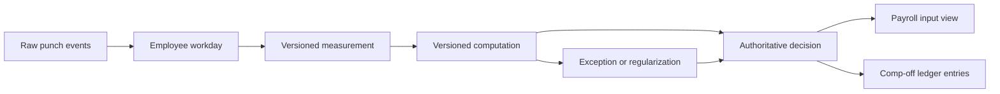

# Attendance V2

Attendance V2 is a new, additive PostgreSQL schema. It leaves the legacy
`public.attendance*` tables and the Excel prototype untouched while the new
workflow is built and verified.

## Design rule

Measurement and approval are different facts:

- Raw events are append-only evidence.
- Measurements can be rebuilt when punch data changes.
- Computations can be rerun under a new ruleset without rewriting evidence.
- Decisions are append-only approvals or rejections. The latest decision is
  authoritative.
- Payroll reads only approved, current decisions from `v_payroll_input`.
- Comp-off is a transaction ledger. Corrections and expiries are new entries,
  never edits to a stored balance.

## Database objects

| Object | Purpose |
| --- | --- |
| `attendance_source` | Registered biometric, mobile, import, API, or manual source |
| `attendance_policy` | Entity-scoped, versioned Attendance Policy configuration |
| `attendance_policy_assignment` | Included and excluded entity, location, department, designation, shift, or employee targets |
| `attendance_event` | Immutable in/out and break events with idempotency keys |
| `attendance_day` | One employee, one work date, with roster/shift/leave context |
| `attendance_measurement` | Versioned first-in, last-out, minutes, and anomalies |
| `measurement_event` | Exact evidence events used by a measurement |
| `computation_run` | Ruleset and period used for a calculation batch |
| `attendance_computation` | Proposed status, payable units, CO, and exception result |
| `attendance_decision` | Append-only authoritative approval or rejection |
| `regularization_request/action` | Employee correction request and immutable workflow history |
| `shift_exception/action` | Detected issue and immutable resolution history |
| `co_ledger_entry` | Signed earn/use/expire/adjust/reversal transactions |
| `report_definition` | Saved attendance report configuration |
| `v_daily_attendance` | Current operational attendance projection |
| `v_co_balance` | Calculated CO balance from ledger entries |
| `v_payroll_input` | Approved attendance units safe for payroll consumption |

## Tenant and role security

Every operational record carries `entity_id` and `location_id`. Records that
belong to a person also carry `employee_id`. Database triggers reject a
location or employee that belongs to another entity.

Row-level security uses these JWT claims:

| Claim | Example | Meaning |
| --- | --- | --- |
| `entity_id` | `12` | Login's home entity |
| `access_entity_id` or `access_entity_ids` | `12` or `[12]` | Allowed entities; `ALL_ENTITIES` is reserved for system admin |
| `access_location_id` or `access_location_ids` | `ALL_MAPPED` or `[31,32]` | Explicit location scope |
| `employee_id` | `481` | Employee linked to the login |
| `attendance_data_scope` | `SELF`, `LOCATIONS`, or `ENTITY` | How widely attendance rows may be read |
| `permission_codes` | `[...]` | Role Master action permissions |
| `is_system_admin` | `true` | Explicit system-admin bypass |

Location scope fails closed. A missing location claim grants no attendance
locations. A franchisee-wide login must explicitly receive `ALL_MAPPED` and
its own entity ID. Role permission and data scope are both required: one does
not replace the other.

Recommended data-scope assignments:

- Employee: `SELF`
- Store admin/manager: `LOCATIONS`
- Franchisee admin: `ENTITY`, own entity, `ALL_MAPPED`
- Primary system admin: `is_system_admin=true`

The backend must issue these as trusted JWT claims. Values coming from browser
storage must never be trusted for database authorization.

## Applying the schema

The migration is in `attendance_v2.sql`. It expects the current public core
tables (`parent_entity`, `sub_location`, `employee_master`, `roster`,
`roster_slots`, `shift_policy_master`, `holiday_calendar`, and
`leave_requests`) to exist.

For Supabase, also expose `hrms_attendance` in API settings if clients need to
query the schema directly. Trusted computation and decision jobs should run in
the backend with the service role; never place the service key in the browser.

## Cutover plan

1. Apply Attendance V2 in a staging database.
2. Issue trusted tenant, employee, data-scope, and permission JWT claims.
3. Connect punch capture to `attendance_event` with idempotency keys.
4. Implement measurement and computation workers.
5. Build regularization, exception, and approval screens against V2.
6. Reconcile `v_payroll_input` against a manually approved sample payroll.
7. Run cross-franchisee isolation tests for every table and view.
8. Switch application reads to V2 only after reconciliation passes.
9. Retire legacy attendance storage in a separate, reversible migration.
